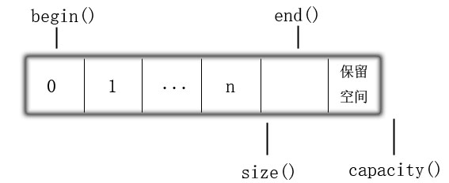

# 容器

## 顺序容器
* 特征：顺序容器为程序提供了控制元素和访问顺序的能力，这种顺序不依赖与元素的值，而是与元素加入容器时的位置相对应。
### vector
* 特征:
    1. 动态数组，长度可变
    2. 内存连续
    3. 对任意元素快速访问，在序列末尾相对快速的添加/删除元素 
    4. 在尾部之外的位置添加/删除元素将会非常耗时。在一次插入或删除元素后，需要移动插入/删除之后的所有元素来保持连续存储。添加元素还可能分配额外的空间，此时没个元素都要移动到新的内存空间中
* 内存分配
    1. size是指容器已保存的元素数量，capacity是在不分配新的内存空间前提下容器最多保存多少元素
    
    2. vector&lt;T&gt;对象可在构造函数中定义初始容量，并填充默认值。此时capacity==size。
    ```C++
    vector<int> v(10);
    int size = v.size();//size=10
    int capacity = v.capacity();//capacity=10
    ```
    3. reserve()改变容量，如果它比当前使用的大则重新分配空间（`capacity = newsize > _Oldcapacity + _Oldcapacity / 2 ? newsize : _Oldcapacity + _Oldcapacity / 2`来自msvc STL。GCC下据说是两倍）并填充默认值。若小于当前容量什么也不做。类似的resize只能改变容器的元素数目，同样不能减少容器的空间
    ```C++
    vector<int> v(10);
    v.resize(11);
    int capacity = v.capacity();//capacity=15
    v.resize(10);
    capacity = v.capacity();//capacity=15
    //v[12] = 1;//error不能通过下标访问
    ```
    4. push_back()元素数量超过capacity，将重新分配空间（参考上条）
* 操作
    1. `void assign(_CRT_GUARDOVERFLOW size_type _Count, const bool& _Val)` 参数1:个数（n）,参数2:值。vector设置_Count个元素为_Val,此操作将改变容器的size
    2. `void assign(_Iter _First, _Iter _Last)` 参数1:迭代器起始，参数2:迭代器终止。拷贝容器
    3. `at(const size_type _Pos)` 参数:索引 若_Pos>=size则抛出异常
    4. `operator[const size_type _Pos]` 类似at()，但_Pos>=size会触发断言
    4. `begin()` 返回迭代器指向容器头（该地址有元素存储），`cbegin()`多了const修饰，`rbegin()`对应`end() - 1`
    5. `end()`  返回迭代器指向容器尾+1（是一个不存在元素的位置），`cend()`多了const修饰，`rend()`对应`begin() - 1`
    7. `back()` 得到容器的最后一个元素的引用
    6. `clear()` 清空
    7. `iterator erase(const_iterator _Where)` 删除迭代器位置元素，指向删除元素(或范围)的下一个元素。注意迭代器失效的问题
    8. `iterator erase(const_iterator _First, const_iterator _Last)` 删除指定范围内的元素，注意开闭区间为:[_First,_Last)（因为迭代器end()对应元素为后一位置。erase(begin(),end())来删除全部元素）
    9. `push_back()` 容器尾添加数据
    10. `pop_back()` 容器尾删除数据
    11. `swap()` 与另一vector交换数据
    12. `insert()` 有三个重载，可以在迭代器位置之前插入一个或多个元素
    13. `emplace(const_iterator _Where, _Valty&&... _Val), emplace_back(_Valty&&... _Val)` “在`_Where`处插入完美转发的`_Val`”STL注释如是说。emplace相关函数可以减少内存拷贝和移动。当插入rvalue，它节约了一次move构造，当插入lvalue，它节约了一次copy构造。
* 总结
    1. 成（随机访问、尾部添加删除元素）也内存连续败（中间位置添加/删除元素）也内存连续
    2. 取元素的成员函数返回的都是引用
### array
* 特征:
    1. 固定大小数组
    2. 不支持添加删除元素
    3. 对比内置数组更安全（operator[]和at()的断言和异常机制）
* 操作
    1. `array<_Ty, _Size>` 构造，前一模板为类型，后一为大小
    2. `assign(const _Ty& _Value)` C++17被移除，作用同`fill()`
    3. `fill(const _Ty& _Value)` 将array用`_Value`填充
    4. `swap(array& _Other)` 交换两个array，`_Ty, _Size`必需一致
    5. `bool empty()` 判断array是否为空（永远返回false）
    6. `operator[const size_type _Pos]` 类似at()，但_Pos>=size会触发断言
    7. `at(const size_type _Pos)` 参数:索引 若_Pos>=size则抛出异常
    8. `size_type max_size()` 和`size()`没有什么不同
    9. `size_type size()` 返回`_Size`
    10. `begin(),cbegin(),rbegin(),end(),cend(),rend()` 同vector
### deque
* 特征
    1. 双端队列，存储多个连续的内存块
    2. 可在队列头以常数时间插入元素
    3. 随机访问性能不如vector，内部插入删除性能不如list
    4. deque没有capacity只有size
* 内存分配
    1. deque 是由一段一段的定量的连续空间构成
    2. 先在堆中分配一块内存空间以供使用，如果添加元素超过分配空间大小，则在堆中再分配相同大小内存空间用来存储新加入的元素
    3. 有此内存特征，deque的迭代器要复杂于vector（需要在不同内存块之间跳转）
    4. deque的内存区块不再被使用时，会被释放。deque的内存大小是可缩减的
* 操作
    1. deque对比vector除了增加`push_front(),pop_front()` 队列头添加/删除元素之外，deque不提供`reverse(),capacity()`操作，其他均一致

### list
* 特征：
    1. 双向链表。只支持双向顺序访问
    2. list每个节点都有前驱指针域、数据域、后续指针域组成
    3. 在list每个位置添加删除元素都是快速的
    4. 不支持元素的随机访问
    5. 与vector、array、deque相比存在额外的内存开销
* 内存分配
    1. 非连续内存，主要通过前驱/后续指针保持逻辑上的顺序
* 操作
    1. `void assign(_CRT_GUARDOVERFLOW size_type _Count, const bool& _Val)` 参数1:个数（n）,参数2:值。vector设置_Count个元素为_Val,此操作将改变容器的size
    2. `void assign(_Iter _First, _Iter _Last)` 参数1:迭代器起始，参数2:迭代器终止。拷贝容器
    3. `void assign(initializer_list<_Ty> _Ilist)` 
    4. `sort()` 升序排序，自定义数据类型可重载operator<()完成排序
    5. `merge(list& _Right)` 合并有序链表，无序链表先`sort()`。不进行排序操作程序将断言。合并完成后_Right为空
    ```C++
    class ListData
    {
    public:
	    std::string name;
	    int number;
	    ListData(int number, std::string name)
	    {
		    this->number = number;
		    this->name = name;
	    }
	    bool operator<(const ListData& data)
	    {
		    return this->number < data.number;
	    }
    };
    struct compareData
    {
        bool operator()(const ListData& data1, const ListData& data2)
        {
            return data1.number < data2.number;
        }
    };
    int main(void)
    {        
		std::list<ListData> list1;
		list1.push_back(ListData(3, "张三"));
		list1.push_back(ListData(2, "王二"));
		list1.push_back(ListData(1, "不认识"));
		list1.sort();
		for (auto& i : list1)
		{
			std::cout << i.name << ",";
		}
		std::cout << std::endl;

		std::list<ListData> list2;
		list4.emplace_back(6, "赵六");
		//list4.push_back(ListData(6, "赵六"));
		list2.push_back(ListData(5, "王五"));
		list2.push_back(ListData(4, "李四"));
		list2.sort();
		list1.merge(list2, compareData());
		for (auto& i : list1)
		{
			std::cout << i.name << ",";
		}
		std::cout << std::endl;
		std::cout << list1.empty() << std::endl;//1
        return 0;
    }        
    ```
    6. `reverse()` 反转链表（注意和reverse拼写区别）
    7. `emplace_back(), push_back(), emplace_front(), push_front()` list尾首插入数据
    8. `list<_Ty>::iterator` list迭代器运算符包括++,--但不包括+/+=。所以
    ```C++
    list<_Ty>::iterator it;
    it+=n;//error
    ```
    9. `unique()` 只去除相邻重复元素，为了达到去重目的应先排序。返回值为去重后的尾地址（去重后并未删除重复元素，而只是放在容器尾部）
### forward_list
* 特征：
    1. 单向链表。只支持单向顺序访问
    2. forward_list迭代器前向有效，效率高于list迭代器
    3. 和list一样每个位置添加删除元素都是快速的
    4. 没有size()。秦某没明白为什么
         > forward_list没有size操作，因为保存或计算大小比手写链表多出额外开销。(C++ primer 第五版)
* 内存分配
    1. 非连续内存，通过后续指针链接下一个元素
* 操作
    1. `assign()` 初始化forward_list
    ```C++    
		std::forward_list<int> flist1;
		flist1.assign({ 0,1,2 });//0,1,2
        flist1.assign(3, 1);//1,1,1
        
		std::forward_list<int> flist2;
        flist2.assign(flist1.begin(), flist1.end());//1,1,1
    ```
    2. `push_front(_Ty&& _Val),emplace_front(_Valty&&... _Val)` 在链表前端插入元素_Val
    3. `emplace_after(const_iterator _Where, _Valty&&... _Val),emplace_after(const_iterator _Where, _Ty&& _Val)` 在迭代器_Where之后插入元素_Val
### 容器适配器
* queue 默认封装了一个deque容器,实现了一个先进先出（FIFO）的数据结构
* stack 默认封装了一个deque容器,实现了一个先进后出（FILO）的数据结构

### 总结
> #### 顺序容器选择（C++ primer 第五版）
    > * 除非你有很好的理由选择其他容器，否则应使用vector
    > * 如果你的程序有很多小的元素，且空间的额外开销很重要，则不要使用list或forward_list
    > * 如果程序要求随机访问元素，应使用deque或vector
    > * 如果程序要求在容器中间插入/删除元素，应使用list或forward_list
    > * 如果程序要求在头尾位置插入/删除元素，但不会在中间位置插入/删除操作，则使用deque
    > * 如果程序只有在读取输入时才需要在容器中间位置插入元素，随后需要随机访问元素，则
        > 1. 首先，确定是否真的需要在容器中间位置添加元素，通常可以很容易地向vector追加数据，然后再调用标准库中的sort函数来重排容器中的元素，从而避免在中间位置添加元素。
        > 2. 如果必须在中间位置插入元素，考虑在输入阶段使用list，一旦输入完成，将list中内容拷贝到一个vector中

|  | 随机访问元素 | 中间插入/删除 | 头插入删除元素 | 尾插入删除元素 |
| ---- | :----: | :----: | :----: | :----: |
| vector | 快 | 慢 | 慢 | 快 |
| array | 快 | --- | --- | --- |
| deque | 快 | 慢 | 快 | 快 |
| list | --- | 快 | 快 | 快 |
| forward_list | --- | 快 | 快 | 快 |

#### Tip
* vector和deque不具有sort()成员函数，但可用std::sort()进行排序
* deque不提供reserve()函数，
* 除array没有insert()外，顺序容器的insert()函数第一个参数均为迭代器位置（插入元素的位置在迭代器位置之前）
    

## 关联容器
* 关联式容器是非线性的树结构，更准确的说是二叉树结构。各元素之间没有严格的物理上的顺序关系，也就是说元素在容器中并没有保存元素置入容器时的逻辑顺序
* 关联容器不需要内存的拷贝和移动
### 按关键字有序保存元素

#### map
* 特征
    1. 关联数组。保存键值对（key-value）,key只能在map中出现一次
    2. map内部数据都是有序的
    3. 若关键字（key）为自定义类型，则需要实现opertor<()运算符。或在map构造函数中传入比较函数。或把比较函数打包成可直接调用的类（重载opertor()）
* 内存
    1. 内部实现为红黑树
    2. 红黑树的查询和维护时间复杂度均为O(logn);
    3. 空间占用比较大，因为每个节点要保持父节点、孩子节点及颜色的信息
> 红黑树:
    >1. 它是二叉排序树:若左子树不空，则左子树上所有结点的值均小于或等于它的根结点的值。若右子树不空，则右子树上所有结点的值均大于或等于它的根结点的值。左、右子树也分别为二叉排序树。
    >2. 它满足如下要求：树中所有节点非红即黑。根节点必为黑节点。红节点的子节点必为黑（黑节点子节点可为黑）。从根到NULL的任何路径上黑结点数相同
    >3. 查找时间一定可以控制在O(logn)。
* 操作
    1. `_Ty& operator[](const key_type& _Keyval)` 通过键（key）做下标访问对应value
    2. `_Ty& at(const key_type& _Keyval)` 根据键（key）来查找值（value），与`operator[]`不同在map中不存在`_Keyval`键时将抛出异常
    3. `iterator find(const key_type& _Keyval)` 根据键（key）来查找键值对，返回的为迭代器。判断是否存在`iterator != map.end()`
    4. `pair<iterator, bool> insert(_Valty&& _Val); iterator insert (const_iterator _Where, _Valty&& _Val); void insert(initializer_list<value_type> _Ilist)` 插入键值对，返回值为pair<迭代器,插入结果>，当键已存在时插入结果为false; 在`_Where`迭代器前插入; 列表插入
    5. `pair<iterator, bool> emplace(_Valtys&&... _Vals)` 与`pair<iterator, bool> insert(_Valty&& _Val)` 类似
    6. `size()` 键值对数量
    7. `clear()` 清空map
    8. ` size_type erase(const key_type& _Keyval); iterator erase(const_iterator _First, const_iterator _Last); iterator erase(iterator _Where)` 删除map中key为_Keyval的键值对，返回为删除的键值对数量（0 or 1）;删除多个键值对注意开闭区间为:[_First,_Last);删除迭代器位置键值对
    9. `key_comp()` 比较两个键的先后。用法:`auto cmp = map.key_comp();cmp(_Keyval1, _Keyva2);`
    10. `value_comp()` 比较两个值的先后。

#### set
* 特征
    1. 只保存关键字（key）的容器
* 内存
    1. 内部实现为红黑树

#### multimap
* 特征
    1. 关键字（key）可重复出现的map

#### multiset
* 特征
    1. 关键字（key）可重复出现的set

### 无序集合

#### unordered_map

#### unordered_set

#### unordered_multimap

#### unordered_multiset